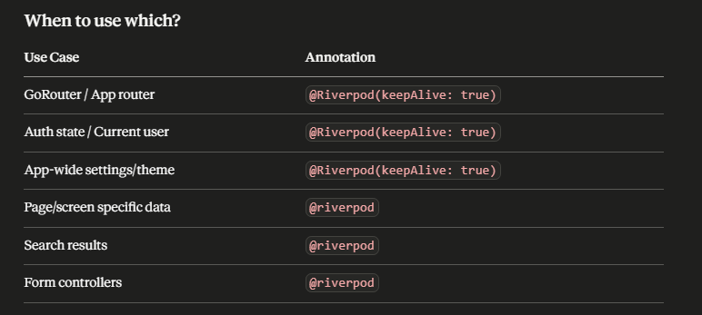
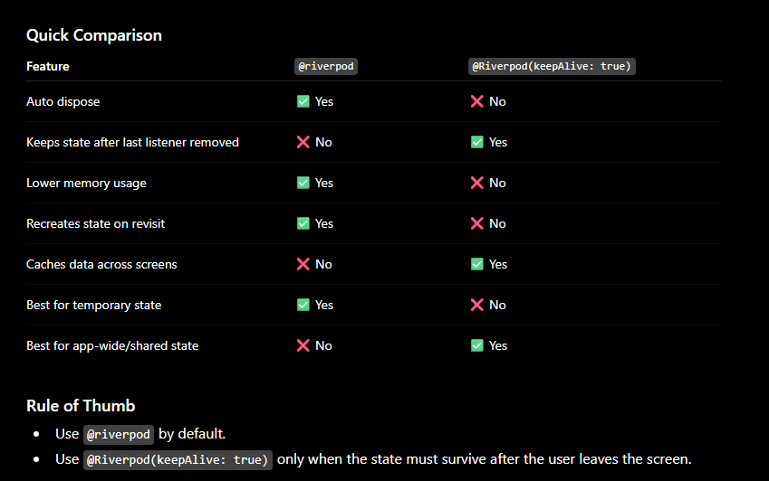

@Riverpod(keepAlive: true) and @riverpod

@riverpod
├── Screen A opens  → provider CREATED
├── Screen A closes → provider DESTROYED ♻️
└── Screen A opens  → provider CREATED again

@Riverpod(keepAlive: true)
├── App starts      → provider CREATED
├── Screen A opens  → same instance
├── Screen A closes → still ALIVE ✅
└── Screen A opens  → same instance (no re-fetch)

Rule of thumb: Use @riverpod by default. Only add keepAlive: true when the data must persist across the entire app lifetime.
Use @Riverpod(keepAlive: true) only when you specifically need the provider's state to survive after all listeners are gone. This keeps memory usage lower and follows Riverpod's recommended pattern.

@riverpod
Generates an auto-dispose provider by default.
Provider is disposed when no longer being listened to.
Frees memory automatically.
State/data is recreated when accessed again.
Suitable for:
Screen-specific state
Temporary UI state
API calls that can be safely refetched
Search/filter providers

@riverpod
Future<User> profile(Ref ref) async {
  return api.getProfile();
}

@Riverpod(keepAlive: true)
Generates a non-auto-dispose provider.
Provider remains alive even when there are no listeners.
Keeps state cached in memory.
Does not recreate state unless invalidated or refreshed.
Suitable for:
Authentication state
User profile
App settings/configuration
Shared repositories/services
Expensive API calls that should not be refetched frequently

Example:

@Riverpod(keepAlive: true)
Future<User> profile(Ref ref) async {
  return api.getProfile();
}

@riverpod vs @Riverpod(keepAlive: true) — Detailed Comparison
1. Lifecycle
@riverpod
Created when first used.
Automatically disposed when no listeners remain.
Recreated when accessed again.
@Riverpod(keepAlive: true)
Created when first used.
Stays in memory even when no listeners exist.
Reused when accessed again.
2. Memory Usage
@riverpod
More memory efficient.
Unused providers are cleaned up automatically.
@Riverpod(keepAlive: true)
Consumes memory until the container is disposed or provider is invalidated.
Better for cached/shared data.
3. Network/API Calls
@riverpod
May trigger API calls again when revisiting a screen.
@Riverpod(keepAlive: true)
Keeps previously fetched data.
Avoids unnecessary API requests.

Example:

@riverpod
Future<List<User>> users(Ref ref) async {
  return api.getUsers();
}

Screen A → fetches users
Leave screen → provider disposed
Return → fetches again

@Riverpod(keepAlive: true)
Future<List<User>> users(Ref ref) async {
  return api.getUsers();
}

Screen A → fetches users
Leave screen → data stays cached
Return → uses cached data

4. State Preservation
@riverpod
State is lost after disposal.
@Riverpod(keepAlive: true)
State remains available.

Example:

@riverpod
class Counter extends _$Counter {
  @override
  int build() => 0;

  void increment() => state++;
}

If no listeners remain:

Counter resets to 0.

With:

@Riverpod(keepAlive: true)
class Counter extends _$Counter {
  @override
  int build() => 0;

  void increment() => state++;
}

If no listeners remain:

Counter keeps its value.
5. App Startup Data

Good candidates for keepAlive: true:

@Riverpod(keepAlive: true)
AppConfig appConfig(Ref ref) {
  return AppConfig.load();
}

Because:

Configuration rarely changes.
Multiple screens need it.
6. Authentication

Recommended:

@Riverpod(keepAlive: true)
class AuthState extends _$AuthState {
  @override
  User? build() {
    return repository.currentUser;
  }
}

Reason:

Authentication is needed throughout the app.
You don't want auth state recreated repeatedly.
7. Search Screen Example

Recommended:

@riverpod
Future<List<Product>> search(
  Ref ref,
  String query,
) async {
  return api.search(query);
}

Reason:

Results are temporary.
No need to keep every search query in memory.
8. Repository Providers

Recommended:

@Riverpod(keepAlive: true)
ApiRepository apiRepository(Ref ref) {
  return ApiRepository();
}

Reason:

Repository is a singleton-like dependency.
Should be shared across the app.
9. Performance Tradeoff
Aspect	@riverpod	@Riverpod(keepAlive: true)
Memory	Lower	Higher
Rebuild Cost	Higher	Lower
API Refetching	More	Less
Cache Persistence	No	Yes
Startup Cost	Lower	Higher
Long-Term State	Not preserved	Preserved
10. Generated Provider Types
@riverpod
String name(Ref ref) => "John";

Generates:

AutoDisposeProvider<String>
@Riverpod(keepAlive: true)
String name(Ref ref) => "John";

Generates:

Provider<String>
11. What Riverpod Team Recommends

The common recommendation is:

Start with @riverpod (auto-dispose) and only opt into keepAlive: true when you have a specific need for persistence or caching.

This helps avoid retaining unused state and keeps memory usage under control.

Practical Rule

Use @riverpod for:

Screen state
Forms
Search results
Temporary filters
Detail pages
Short-lived API calls

Use @Riverpod(keepAlive: true) for:

Authentication
User profile
App settings
Theme/locale
Repositories/services
Shared cached data
Expensive API responses that should survive navigation changes.
Get smarter responses, upload files and images, and more.